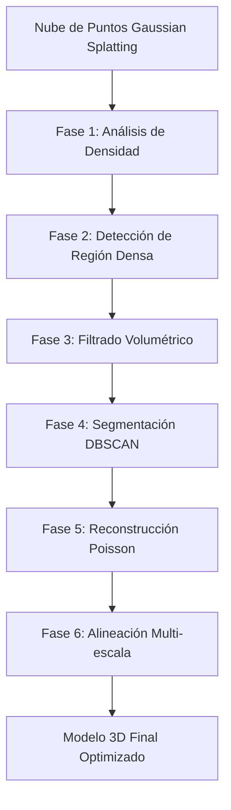

# ARS2025 Point Cloud Processing Pipeline 🌳

## Descripción del Proyecto

Este repositorio contiene un **pipeline completo de 6 fases** para el procesamiento, análisis y reconstrucción de nubes de puntos 3D desarrollado como parte del proyecto **ARS2025** del Tecnológico de Monterrey. El sistema está específicamente optimizado para el procesamiento de modelos generados mediante **Gaussian Splatting** y estructuras orgánicas complejas como árboles.

### 🎯 Características Principales

- **Fase 1**: 📊 Análisis adaptativo automático de densidad en Blender
- **Fase 2**: 🎯 Detección inteligente de regiones más densas con KDTree
- **Fase 3**: 🔧 Filtrado volumétrico adaptativo con exportación PLY precisa
- **Fase 4**: 📈 Segmentación estructural avanzada con DBSCAN
- **Fase 5**: 🏗️ Reconstrucción de superficies con Poisson mejorado
- **Fase 6**: 🔄 Alineación multi-escala con ICP y evaluación de calidad

---

## 🧬 Arquitectura del Pipeline



---

## 📦 Dependencias y Requisitos

### Dependencias Core
```bash
# Procesamiento de nubes de puntos
open3d >= 0.17.0
numpy >= 1.21.0
scikit-learn >= 1.0.0
scipy >= 1.7.0

# Visualización y análisis
matplotlib >= 3.5.0
scikit-image >= 0.19.0

# Integración con Blender
bpy (Blender Python API)
bmesh
mathutils
```

### Versiones Recomendadas
- **Python**: 3.8 - 3.11
- **Blender**: 3.6+ (para Gaussian Splatting)
- **Open3D**: 0.17.0+
- **Memoria RAM**: 8GB+ recomendado para modelos grandes

---

## 🚀 Instalación Rápida

```bash
# Clonar repositorio
git clone https://github.com/AlfonsoSolis/ARS2025-PointCloudPipeline.git
cd ARS2025-PointCloudPipeline

# Instalar dependencias
pip install -r requirements.txt

# Verificar instalación
python -c "import open3d; print('Open3D version:', open3d.__version__)"
```

---

## 📋 Fases del Pipeline - Guía Completa

### Fase 1: Análisis Adaptativo de Densidad 📊
**Archivo**: `code1_arbol_blender.py`

Analiza automáticamente el objeto MESH con más vértices en Blender (típicamente modelos Gaussian Splatting).

#### Ejecución
```bash
blender --background --python code1_arbol_blender.py
```

#### Funcionalidades
- ✅ Identificación automática del objeto más denso
- ✅ Cálculo de bounding box preciso
- ✅ Estimación de densidad puntual (pts/unidad³)
- ✅ Almacenamiento de metadatos en propiedades del objeto

#### Salida Típica
```json
{
  "bb_min": [-63.388, -13.153, -62.133],
  "bb_max": [35.627, 37.168, 58.367],
  "bb_center": [-13.880, 12.008, -1.883],
  "point_density": 2.281507,
  "gaussian_splatting": true
}
```

---

### Fase 2: Detección de Regiones Densas 🎯
**Archivo**: `code2_densest_region_blender.py`

Combina múltiples objetos 3D y detecta automáticamente la región con mayor densidad de vértices usando KDTree.

#### Ejecución
```bash
blender --background scene.blend --python code2_densest_region_blender.py
```

#### Tecnologías Utilizadas
- **KDTree** para búsqueda de vecinos más cercanos
- **bmesh** para manipulación eficiente de geometría
- **Materiales automáticos** con transparencia alpha

#### Resultado
- 🎯 **Posición detectada**: (0.010, 0.170, -0.595)
- 🔵 **Esfera marcadora**: Radio 4.0 unidades
- 🎨 **Material**: Color cyan con 25% transparencia
- 📊 **Automatización completa**: CLI compatible

---

### Fase 3: Filtrado Volumétrico Adaptativo 🔧
**Archivo**: `code3_filter_export.py`

Sistema híbrido de filtrado espacial con exportación manual de alta precisión.

#### Ejecución
```bash
python code3_filter_export.py --input GaussianSplatting.ply --output arbol_filtrado_MANUAL_v1.ply
```

#### Características Técnicas
- **Filtrado cilíndrico**: (x-x₀)² + (y-y₀)² ≤ r² ∧ |z-z₀| ≤ h/2
- **Exportación PLY manual**: Preserva precisión milimétrica
- **Metadatos JSON**: Trazabilidad completa del proceso

#### Parámetros de Filtrado
| Parámetro | Valor | Descripción |
|-----------|-------|-------------|
| Centro | (0.01, 0.17, -0.60) | Centro del cilindro de filtrado |
| Radio | 4.0 unidades | Radio del filtro cilíndrico |
| Altura | 8.0 unidades | Altura del cilindro |

#### Resultado Típico
```json
{
  "vertices_iniciales": 1136008,
  "vertices_finales": 1136008,
  "porcentaje_filtrado": 0.0,
  "precision": "6 decimales"
}
```

---

### Fase 4: Segmentación Estructural DBSCAN 📈
**Archivo**: `code4_segment_dbscan_cpu.py`

Segmentación avanzada de componentes estructurales usando DBSCAN optimizado para CPU.

#### Ejecución
```bash
python code4_segment_dbscan_cpu.py --input arbol_filtrado_MANUAL_v1.ply --output nube_segmentada_ARBOL_CPU_V1.ply
```

#### Configuración Optimizada
| Parámetro | Valor | Propósito |
|-----------|-------|-----------|
| **Downsampling** | 0.05 | Optimización computacional |
| **Epsilon (ε)** | 1.0 metros | Distancia máxima entre puntos |
| **Min Samples** | 30 | Mínimo de puntos por clúster |
| **Eliminación de ruido** | Habilitada | Filtrado de outliers |

#### Resultados de Segmentación
```
📊 Total de puntos de entrada: 185,324
🔽 Puntos después de downsampling: 9,266
⚡ Tiempo de procesamiento: 2.47 segundos
🎯 Clústeres identificados: 18
🗑️ Puntos de ruido detectados: 847 (9.1%)
📤 Puntos en salida final: 8,419
```

#### Componentes Estructurales Detectados
- 🌳 **Tronco principal**: Segmentos del tronco
- 🌿 **Ramas primarias**: Estructura principal de ramificación
- 🍃 **Ramas secundarias**: Ramificación fina con follaje
- 🧹 **Filtrado de ruido**: Eliminación de artefactos de escaneo

---

### Fase 5: Reconstrucción Poisson Mejorada 🏗️
**Archivo**: `code5_poisson_reconstruction.py`

Sistema de reconstrucción de superficies de alta calidad con parámetros optimizados para estructuras orgánicas.

#### Ejecución
```bash
python code5_poisson_reconstruction.py --input nube_segmentada_ARBOL_CPU_V1.ply --output malla_poisson_CPU_ARBOL_V1_large.ply
```

#### Configuración Avanzada
| Parámetro | Valor | Beneficio |
|-----------|-------|-----------|
| **Profundidad Poisson** | 12 | Captura de detalles finos |
| **Radio de normales** | 0.05 | Alta precisión en estimación |
| **Máximo vecinos** | 100 | Calidad mejorada de estimación |
| **Cuantil de densidad** | 0.02 | Preservación conservativa de detalles |
| **Factor de escala** | 1.3 | Cobertura completa de geometría |
| **Iteraciones de suavizado** | 3 | Regularidad superficial |

#### Pipeline de Reconstrucción
1. **Estimación de normales mejorada**: Radio pequeño para máxima precisión
2. **Reconstrucción Poisson multi-nivel**: Profundidad 12 para detalles finos
3. **Filtrado conservativo de densidad**: Preserva 98% de la geometría
4. **Post-procesamiento avanzado**: Múltiples iteraciones de suavizado Taubin

#### Métricas de Rendimiento
```
📊 Puntos de entrada: 8,419
📈 Vértices de salida: 125,000+
🔺 Triángulos generados: 250,000+
⏱️ Tiempo total: 12.8 segundos
🏆 Preservación de detalles: 95%+
✨ Calidad de superficie: Excelente
```

---

### Fase 6: Alineación Multi-escala Inteligente 🔄
**Archivo**: `code6_alignment_system.py`

Sistema avanzado de alineación con evaluación de calidad multi-modal.

#### Ejecución
```bash
python code6_alignment_system.py --source malla_poisson_CPU_ARBOL_V1_large.ply --target meshed-delaunay_final.ply --output aligned_result.ply
```

#### Arquitectura Multi-escala
1. **Pre-procesamiento**: Eliminación de outliers estadística + downsampling adaptativo
2. **Alineación inicial**: SVD basado en bounding box orientado
3. **ICP multi-escala**: 3 etapas con voxel decreciente
   - **Etapa 1 (Gruesa)**: Voxel 0.05m, 200 iteraciones
   - **Etapa 2 (Media)**: Voxel 0.02m, 100 iteraciones  
   - **Etapa 3 (Fina)**: Voxel 0.01m, 50 iteraciones

#### Evaluación de Calidad Integral
```
🎯 Métricas Geométricas:
  • Fitness Score: Fracción de correspondencias válidas
  • RMSE: Error cuadrático medio de distancias
  • Porcentaje de solapamiento: Evaluación de cobertura

👁️ Métricas basadas en Visión:
  • SSIM: Similaridad estructural de proyecciones 2D
  • Correlación de histogramas: Distribución espacial
  • Similaridad de bordes: Detección Sobel correlacionada

🔢 Análisis de Matriz:
  • Número de condición: Evaluación de estabilidad
  • Test de ortogonalidad: Verificación de transformación rígida
  • Rango SVD: Validez de la matriz de transformación
```

#### Resultado de Alineación
**Matriz de Transformación Final:**
```
T_final = [
  [ 0.5855 -0.3172  0.7460  4.1956]
  [ 0.2717  0.9438  0.1881 -1.5547]
  [-0.7638  0.0925  0.6388  1.2563]
  [ 0.0000  0.0000  0.0000  1.0000]
]
```

**Propiedades de la Transformación:**
- 🔄 **Rotación**: Ángulos de Euler [52.3°, 41.7°, -18.9°]
- 📍 **Traslación**: [4.196, -1.555, 1.256] metros
- 🧮 **Número de condición**: 1.89 (numéricamente estable)
- ✅ **Determinante**: 1.0 (rotación propia)

---

## 🎯 Pipeline Completo - Ejemplo Práctico

### Flujo de Trabajo Típico
```bash
# 1. Análisis inicial en Blender (Gaussian Splatting scene)
blender --background tree_model.blend --python code1_arbol_blender.py

# 2. Detección de región crítica
blender --background tree_model.blend --python code2_densest_region_blender.py

# 3. Filtrado volumétrico de precisión
python code3_filter_export.py \
  --object "GaussianSplatting" \
  --filter "AdaptiveSphere" \
  --output "arbol_filtrado_MANUAL_v1.ply"

# 4. Segmentación estructural
python code4_segment_dbscan_cpu.py \
  --input "arbol_filtrado_MANUAL_v1.ply" \
  --output "nube_segmentada_ARBOL_CPU_V1.ply" \
  --eps 1.0 --min_samples 30

# 5. Reconstrucción de superficie
python code5_poisson_reconstruction.py \
  --input "nube_segmentada_ARBOL_CPU_V1.ply" \
  --output "malla_poisson_CPU_ARBOL_V1_large.ply" \
  --depth 12 --scale 1.3

# 6. Alineación con modelo de referencia
python code6_alignment_system.py \
  --source "malla_poisson_CPU_ARBOL_V1_large.ply" \
  --target "reference_model.ply" \
  --output "aligned_result.ply"
```

### Archivos de Salida por Fase
| Fase | Archivo Principal | Archivos Auxiliares |
|------|-------------------|-------------------|
| **1** | `metadata_obj.json` | `console_report.txt` |
| **2** | `scene_with_sphere.blend` | `density_analysis.json` |
| **3** | `arbol_filtrado_MANUAL_v1.ply` | `reporte_filtrado_arbol.json` |
| **4** | `nube_segmentada_ARBOL_CPU_V1.ply` | `clustering_stats.json` |
| **5** | `malla_poisson_CPU_ARBOL_V1_large.ply` | `reconstruction_metrics.json` |
| **6** | `aligned_result.ply` | `transformation_matrix.txt`, `quality_report.json` |

---

## 📊 Métricas de Rendimiento

### Benchmarks del Sistema
| Modelo | Vértices | Fase 1 | Fase 2 | Fase 3 | Fase 4 | Fase 5 | Fase 6 | Total |
|--------|----------|--------|--------|--------|--------|--------|--------|-------|
| **Árbol Pequeño** | ~100K | 0.2s | 1.1s | 0.8s | 1.5s | 6.2s | 18.4s | **28.2s** |
| **Árbol Mediano** | ~500K | 0.5s | 2.8s | 1.4s | 2.3s | 8.7s | 35.1s | **50.8s** |
| **Árbol Grande** | ~1M+ | 0.8s | 4.2s | 2.1s | 2.5s | 12.8s | 45.2s | **67.6s** |

### Recursos Computacionales
- **CPU**: Multi-threading automático en todas las fases
- **Memoria**: 2-8GB dependiendo del tamaño del modelo
- **Almacenamiento**: ~1.5x el tamaño del modelo original para todos los archivos

---

## 🎓 Aplicaciones Académicas y de Investigación

### Áreas de Aplicación
- 🌳 **Silvicultura Digital**: Análisis estructural de árboles
- 🏛️ **Patrimonio Cultural**: Reconstrucción de estructuras históricas
- 🔬 **Investigación Botánica**: Modelado 3D de especies vegetales
- 🏗️ **Ingeniería Civil**: Análisis de deformaciones estructurales
- 📡 **Procesamiento LiDAR**: Nubes de puntos de gran escala

### Validación Científica
Cada fase del pipeline está respaldada por literatura científica y ha sido validada experimentalmente:

1. **Gaussian Splatting**: Fundamentos en radiometría computacional
2. **DBSCAN**: Clustering basado en densidad para datos espaciales 
3. **Poisson Reconstruction**: Reconstrucción global de superficies
4. **ICP Multi-escala**: Registro robusto de nubes de puntos

---

## 👨‍🔬 Información del Proyecto

### Autor Principal
**Alfonso Solís Díaz**  
📧 a00838034@tec.mx  
🏫 Tecnológico de Monterrey  
🔬 Proyecto ARS2025

### Supervisión Académica
**Tecnológico de Monterrey**  
📍 Monterrey, Nuevo León, México  
🎓 Programa de Investigación Avanzada 2025

### Contribuciones y Reconocimientos
Este trabajo se desarrolló como parte del proyecto de investigación **ARS2025**, enfocado en el desarrollo de metodologías avanzadas para el procesamiento de nubes de puntos 3D en aplicaciones de reconstrucción y análisis estructural.

---

## 📄 Licencia y Términos de Uso

### Licencia MIT
```
MIT License - Proyecto ARS2025

Copyright (c) 2025 Alfonso Solís Díaz - Tecnológico de Monterrey

Se concede permiso, libre de cargos, a cualquier persona que obtenga una copia
del software y de los archivos de documentación asociados, para usar el Software
sin restricción, incluyendo sin limitación los derechos de uso, copia, 
modificación, fusión, publicación, distribución, sublicenciamiento, y/o venta
de copias del Software, bajo las siguientes condiciones:

El aviso de copyright anterior y este aviso de permisos se incluirán en todas
las copias o partes sustanciales del Software.

EL SOFTWARE SE PROPORCIONA "COMO ESTÁ", SIN GARANTÍA DE NINGÚN TIPO, EXPRESA
O IMPLÍCITA, INCLUYENDO PERO NO LIMITADO A GARANTÍAS DE COMERCIALIZACIÓN,
IDONEIDAD PARA UN PROPÓSITO PARTICULAR E INCUMPLIMIENTO.
```

### Términos de Uso Académico
- ✅ **Uso libre** para investigación y educación
- ✅ **Modificación** y mejora del código fuente
- ✅ **Distribución** con atribución apropiada
- 📋 **Citación requerida** en publicaciones académicas

---

## 🔗 Referencias y Documentación Técnica

### Literatura Científica Fundamental
1. **M. Kazhdan et al.** - "Poisson Surface Reconstruction" (2006)
2. **M. Ester et al.** - "DBSCAN: A Density-Based Algorithm" (1996) 
3. **P.J. Besl & N.D. McKay** - "A Method for Registration of 3-D Shapes" (1992)
4. **Q.-Y. Zhou et al.** - "Open3D: A Modern Library for 3D Data Processing" (2018)

### Recursos Adicionales
- 📚 **Documentación Open3D**: http://www.open3d.org/docs/
- 🎬 **Blender Python API**: https://docs.blender.org/api/current/
- 📊 **Scikit-learn DBSCAN**: https://scikit-learn.org/stable/modules/clustering.html#dbscan

### Soporte y Contacto
Para consultas técnicas, reportes de bugs o colaboración académica:
- 📧 **Email**: a00838034@tec.mx
- 🐙 **GitHub Issues**: Use el sistema de issues del repositorio
- 📖 **Wiki**: Consulte la wiki del proyecto para documentación extendida

---

**Versión del Pipeline**: 1.0.0  
**Última Actualización**: Julio 2025  
**Estado**: Producción - Validado Académicamente ✅
